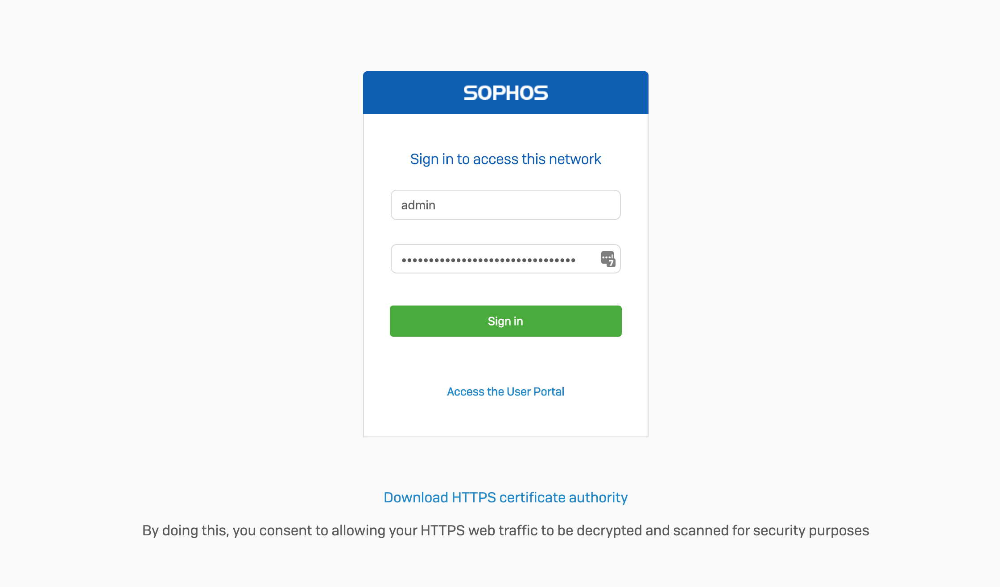

# **Sophos Captive Portal Autologin for IoT Devices and Servers**



## Overview

**Sophos Captive Portal Autologin** provides a solution to automatically authenticate with Sophos Captive Portals, eliminating the need for manual login each time. This is particularly useful for IoT devices and servers that need to stay connected without user intervention. The project includes implementations for both Python (for servers) and C++ (for ESP32/ESP8266 IoT devices).

### Key Features
- **Automatic Authentication**: Seamlessly handles login processes for Sophos Captive Portals.
- **Server and IoT Device Compatibility**: Includes solutions for both server environments and embedded systems.
- **No UI Required**: Operates in the background without needing a user interface.

---

## Table of Contents

1. [Getting Started](#getting-started)
2. [Installation](#installation)
3. [Configuration](#configuration)
4. [Usage](#usage)
   - [Python Implementation](#python-implementation)
   - [C++ (ESP32/ESP8266) Implementation](#cpp-implementation)
5. [Sample Login Page](#sample-login-page)
6. [License](#license)
7. [Contributing](#contributing)
8. [Support](#support)

---

## Getting Started

This project automates the process of logging into a Sophos Captive Portal, ensuring continuous connectivity for both servers and IoT devices.

---

## Installation

### Python Implementation

1. Clone the repository to your local machine:
   ```bash
   git clone https://github.com/blacklovertech/captive-portal-autologin.git
   ```
2. Navigate to the project directory:
   ```bash
   cd sophos-captive-portal-autologin
   ```
3. Install the required Python packages:
   ```bash
   pip install -r requirements.txt
   ```

### C++ (ESP32/ESP8266) Implementation

1. Clone the repository to your local machine:
   ```bash
   git clone https://github.com/blacklovertech/captive-portal-autologin.git
   ```
2. Open the project files in your development environment (Arduino IDE or PlatformIO).
3. Follow the instructions in the code comments to configure your device.

---

## Configuration

### Python Configuration

Edit the `config.py` file to set your network credentials and Sophos Captive Portal details:
```python
base_url = 'http://ip_address_of_your_login_portal/'
login_url = f'{base_url}/login.xml'
logout_url = f'{base_url}/logout.xml'
username = 'your_username'
password = 'your_password'
```

### C++ Configuration

Modify the configuration parameters in the C++ code:
```cpp
const char* ssid = "your_SSID";
const char* password = "your_password";
const char* login_url = "http://ip_address_of_your_login_portal/login.xml";
const char* logout_url = "http://ip_address_of_your_login_portal/logout.xml";
```

---

## Usage

### Python Implementation

Run the Python script to start the auto-login process:
```bash
python main.py
```
The script will log in to the captive portal and periodically maintain the connection.

### C++ (ESP32/ESP8266) Implementation

Upload the C++ code to your ESP32/ESP8266 device. The device will automatically handle the login process upon connecting to the WiFi network.

---

## Sample Login Page

A sample HTML template is provided to help understand the typical login page format used by Sophos Captive Portals. This can be useful for troubleshooting and customization.

---

## License

This project is licensed under the MIT License. See the [LICENSE](LICENSE) file for more details.

---

## Contributing

Contributions are welcome! Please see the [CONTRIBUTING](CONTRIBUTING.md) guidelines for information on how to contribute.

---

## Support

For support, please open an issue on [GitHub](https://github.com/blacklovertech/captive-portal-autologin/issues) or contact us at support@yourdomain.com.

---
